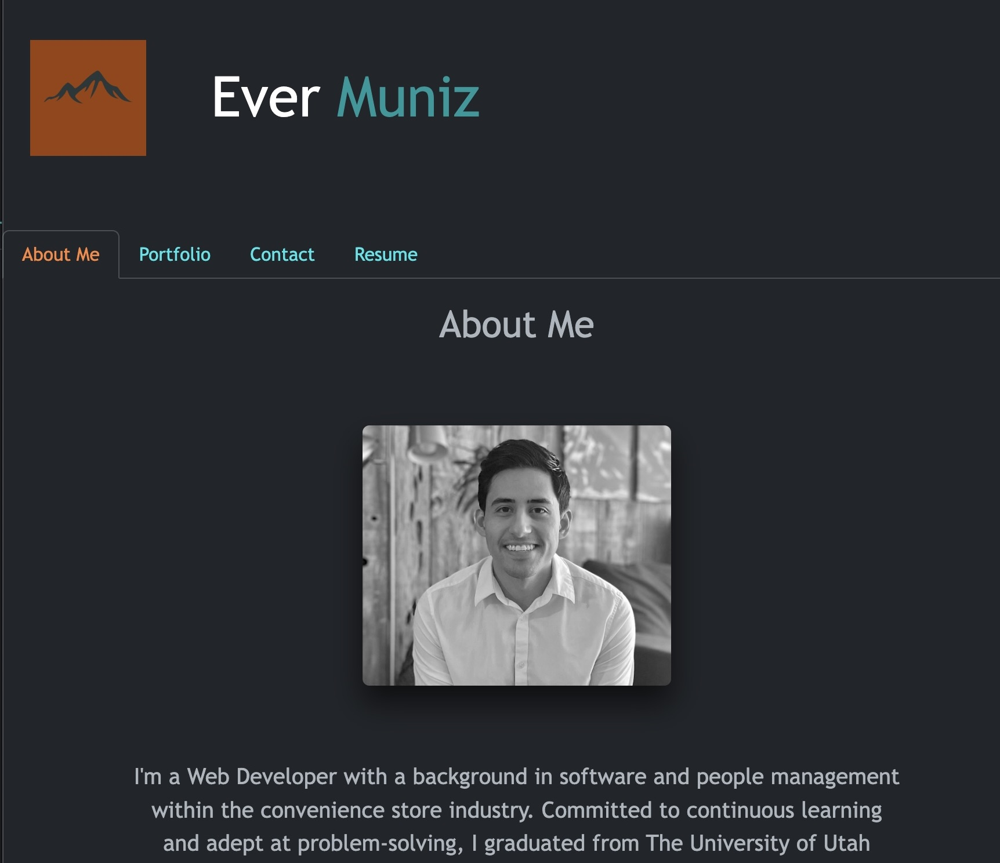

# Professional-Portfolio
 

## Description

I built this application for potential employers to learn about me, my work, and how to contact me. The projects in my portfolio were created using skills I learned through the University of Utah's Coding Bootcamp.   

## Table of Contents (Optional)

- [Usage](#usage)
- [Credits](#credits)
- [License](#license)

## Usage
Visit my [website]() to learn about my skills, view applications I have created, contact me, and download my resume. 

## Credits
- Reactjs
- Bootstrap
- Emailjs
- References provided by the University of Utah Coding Bootcamp
- uiverse.io used as inspiration for custom styling and animations

## License
This project is licensed under the MIT license.

  ## Questions

  If you have any questions, please contact me at evermuniz@outlook.com.
  You can also visit my GitHub profile [here](https://github.com/evermuniz/)